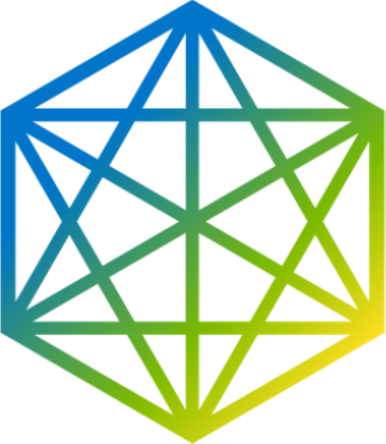

# 
OpenJS

---

***OpenJS Foundation*** is to support the healthy growth of JavaScript and web technologies by providing a neutral organization to host and sustain projects, as well as collaboratively fund activities that benefit the ecosystem as a whole.

> The ***OpenJS Foundation*** is <u>made up of 32 open source JavaScript projects including Appium, Dojo, Electron, jQuery, Node.js, and webpack</u>.

> Their goal is to make it easy and straightforward for projects to join the ***OpenJS Foundation*** and take advantage of our technical and community governance templates.

---
